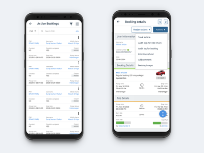

# Musify: AppDev Hack Challenge 2021

## An app to help you organize your music and listen to your favorite bops wherever you go!

INSERT IMAGES HERE

## Description

Musify is a personalized Android app designed to help you organize your music
and listen to your favorite tunes at any time. Through the app, you're able to
create your own playlists and add your favorite songs. Additionally, you can
attach Youtube links to your songs so that you can directly play their music
videos in the app!

## Requirements Fulfilled:

### Android

Android requirements here

### Backend

- Deployed at https://musifyappdev.herokuapp.com
- Designed 3 classes in SQLAlchemy modeling Users, Playlists, and Songs
  - One-to-many relation for Users to Playlists
  - Many-to-many relation for Playlists and Songs
- Implemented 12 routes:
  - 5 GET routes
  - 4 POST routes
  - 3 DELETE routes
- Detailed API specification in backend/api.md
